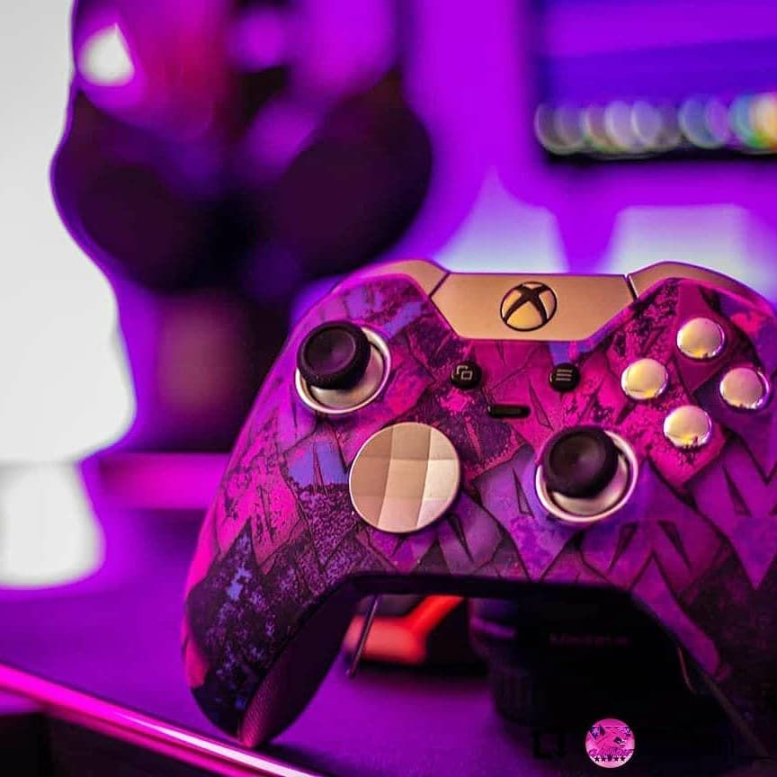
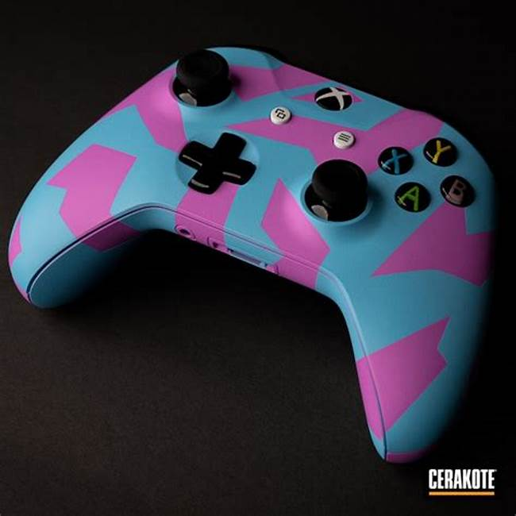

<HTML>
<HEAD> 
<TITLE>HOME PAGE</TITLE>

</HEAD>
<BODY>
<H1> GAMER'S SKY </H1>

<MARQUEE>
</MARQUEE>

<H3><A HREF = "file:///C:/Users/Master/Desktop/html/GR.html" TARGET="_blank"> QUIZ </A> </H3>
<H3> <A HREF = "https://www.crazygames.com/game/fairy-puzzle" TARGET="_blank"> PUZZLE </A> </H3>
<H3> <A HREF = "https://www.crazygames.com/game/cups---water-sort-puzzle" TARGET="_blank"> WATER SORT PUZZLE </A> </H3>
<H3> <A HREF = "https://www.crazygames.com/game/poly-art-3d" TARGET=_blank"> POLY ART </A> </H3>
<H3> <A HREF = "https://www.crazygame
